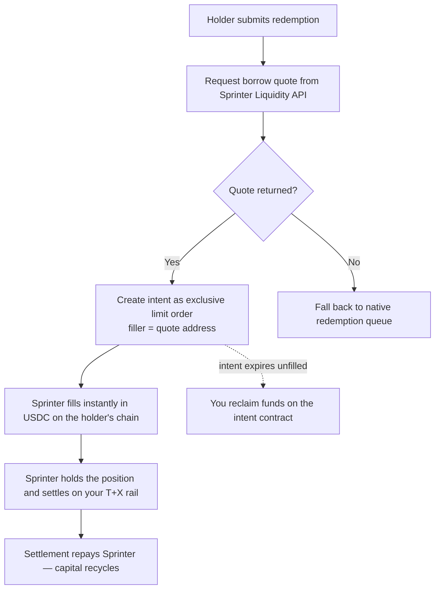

## Overview

If you issue an asset that settles on a delay — a tokenized treasury, a bond fund, a yield-bearing stablecoin, a structured vault — Sprinter can front the liquidity so your holders enter and exit instantly, while the underlying settles on your own rail in the background.

Your tokenized asset is onboarded first. Sprinter quotes only assets it has underwritten, allocated liquidity to and configured routes for, so onboarding is step 1 and the runtime calls follow from there.

Two paths. The **solver model** described here gets you live without protocol changes. The **facility model** commits dedicated capacity and is agreed commercially — see [Redemption & Subscription Liquidity](/stash-v1/redemption-liquidity).

The sequence is one onboarding phase, then three runtime steps per redemption:

1. **Onboard the asset** — one time. Underwriting, liquidity allocation, route configuration
2. **Quote** — ask Sprinter what it will pay for the position
3. **Create intent** — publish the redemption as an exclusive limit order to Sprinter
4. **Settle** — Sprinter fills instantly; you settle the underlying on your rail

---

## Step 1 — Onboard the asset

This is a joint process, not a self-serve API call. Sprinter has to understand the settlement path before it will lend against it, then commit capital and wire up routing.

### What you submit

| | Why Sprinter needs it |
|---|---|
| **Settlement rail** — mechanism, cadence, business-day convention, valuation cut-off | Sets how long capital is locked, which sets the price |
| **Caps** — daily or per-valuation limits on redemption volume, and what happens to requests that breach them | Determines how much can be fronted before hitting your queue |
| **Price source** — NAV stream or oracle, update frequency, acceptable staleness | Sprinter quotes off this; stale prices mean no quote |
| **Contract addresses** — the token, plus any dedicated mint/redeem or express contracts | Integration and route configuration |
| **Eligibility** — whether Sprinter needs whitelisting on the redemption rail, and the KYB steps | Sprinter must be able to actually redeem what it holds |
| **Chains** — launch chain priority and planned expansion | Determines which pools and routes are configured |

### Confirm the asset is live

Before wiring up runtime calls, check that your token is returned by [supported tokens for a chain](/api-reference/sprinter/liquidity/returns-supported-tokens-for-a-chain). If it isn't there, onboarding is not complete and quotes will not return.

<Note>
  Onboarding is per asset and per chain. Adding a second asset, or the same asset on a new chain, needs its own underwriting and route configuration — usually much faster than the first, since the settlement rail is already understood.
</Note>

---

## Runtime flow

Once the asset is live, this runs per redemption.

### Step 2 — Request a quote

Ask the Sprinter Liquidity API what it will pay for the position on the holder's chosen chain. See [Get the borrow quote](/api-reference/sprinter/liquidity/get-the-borrow-quote-for-a-liquidity-transaction-based-on-the-input-data) for the request and response schema.

The quote returns a price and the **address that will fill it**. Keep that address — step 3 needs it.

<Note>
  Quotes are time-bounded. Treat a returned quote as valid only for its stated window and re-quote rather than reusing a stale one. If no quote returns for an onboarded asset — capacity is exhausted, the price is stale, or the size exceeds a limit — fall back to your native redemption queue. Sprinter declining a fill should never block a holder from redeeming.
</Note>

### Step 3 — Create the intent

Publish the redemption as an intent through your intent protocol — for example with the [LI.FI SDK](https://docs.li.fi/sdk/overview), creating a [LI.FI intent](https://docs.li.fi/lifi-intents/intents-api/create-and-submit).

Two things matter:

- Create it as an **exclusive limit order**, not an open order
- Set the **quote's address as the exclusive filler**, so only Sprinter can fill at the quoted price

This is what makes the fill deterministic: the holder is quoted a price, and that exact price is what fills.

### Step 4 — Settle, or reclaim

**If filled:** the holder receives USDC immediately on their chosen chain. Sprinter holds the position and settles it through your native rail. When settlement completes, Sprinter is repaid and the capital recycles into the next fill.

**If the intent expires unfilled:** you reclaim the funds on the intent contract. Nothing is stranded — an unfilled intent is a no-op.

## Next steps

<CardGroup cols={2}>
  <Card title="Redemption & Subscription Liquidity" icon="book" href="/stash-v1/redemption-liquidity">
    How the product works, pricing shape, and underwriting criteria.
  </Card>
  <Card title="Start onboarding" icon="comments" href="https://t.me/sprinter_tech/1">
    Facility sizing, pricing, and asset underwriting.
  </Card>
</CardGroup>
