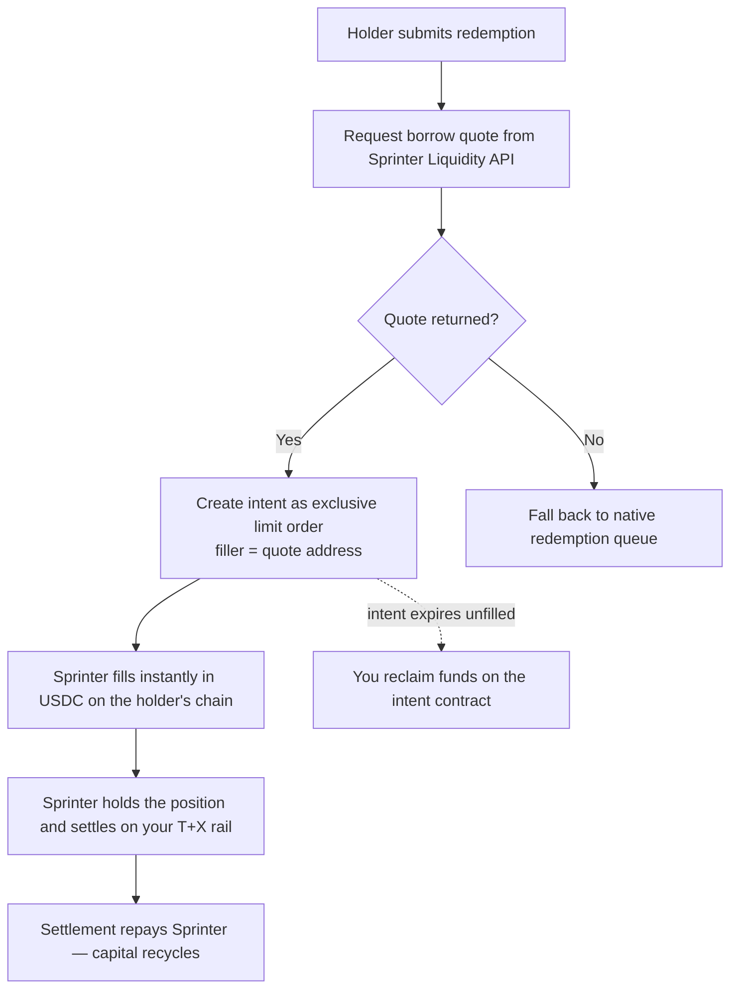

## Overview

If you issue an asset that settles on a delay — a tokenized treasury, a bond fund, a yield-bearing stablecoin, a structured vault — Sprinter can front the liquidity so your holders enter and exit instantly, while the underlying settles on your own rail in the background.

Two paths. The **solver model** gets you live without protocol changes and is described here. The **facility model** commits dedicated capacity and is agreed commercially — see [Redemption & Subscription Liquidity](/stash-v1/redemption-liquidity).

Your integration is three steps:

1. **Quote** — ask Sprinter what it will pay for the position
2. **Create intent** — publish the redemption as an exclusive limit order to Sprinter
3. **Settle** — Sprinter fills instantly; you settle the underlying on your rail

## Division of responsibilities

| You handle | Sprinter handles |
|---|---|
| Holder eligibility, KYC and whitelisting | Quoting the position and pricing the settlement delay |
| Publishing the redemption intent | Fronting USDC to the holder instantly, on their chain |
| Settling the underlying on your native rail | Holding the position through the settlement window |
| NAV or price stream | Underwriting, risk monitoring and automated recovery |

## Step 1 — Request a quote

Ask the Sprinter Liquidity API what it will pay for the position on the holder's chosen chain. See [Get the borrow quote](/api-reference/sprinter/liquidity/get-the-borrow-quote-for-a-liquidity-transaction-based-on-the-input-data) for the full request and response schema.

The quote returns a price and the **address that will fill it**. Keep that address — step 2 needs it.

<Note>
  Quotes are time-bounded. Treat a returned quote as valid only for its stated window, and re-quote rather than reusing a stale one. If no quote returns, fall back to your native redemption queue — Sprinter declining a fill should never block a holder from redeeming.
</Note>

## Step 2 — Create the intent

If a quote returns, publish the redemption as an intent through your intent protocol — for example with the [LI.FI SDK](https://docs.li.fi/sdk/overview), creating a [LI.FI intent](https://docs.li.fi/lifi-intents/intents-api/create-and-submit).

Two things matter:

- Create it as an **exclusive limit order**, not an open order
- Set the **quote's address as the exclusive filler**, so only Sprinter can fill at the quoted price

This is what makes the fill deterministic: the holder is quoted a price, and that exact price is what fills.

## Step 3 — Settle, or reclaim

**If filled:** the holder receives USDC immediately on their chosen chain. Sprinter holds the position and settles it through your native rail. When settlement completes, Sprinter is repaid and the capital recycles into the next fill.

**If the intent expires unfilled:** you reclaim the funds on the intent contract. Nothing is stranded — an unfilled intent is a no-op.

## Onboarding

Steps run concurrently, not in sequence:

| Step | Typical duration |
|---|---|
| KYB and whitelisting with Sprinter | ~1 week |
| Asset underwriting — settlement rail, price stream, caps, fallback | 1–2 weeks, concurrent |
| Intent protocol integration | 1–2 weeks |
| Soft launch on a single chain, then go-live | — |

### What Sprinter needs from you

- **Settlement rail** — the mechanism, its cadence, business-day convention and any valuation cut-off
- **Caps** — daily or per-valuation limits on redemption volume, and what happens to queued requests that breach them
- **Price source** — NAV stream or oracle, its update frequency and acceptable staleness
- **Contract addresses** — the token, and any dedicated mint/redeem or express contracts
- **Eligibility** — whether Sprinter needs whitelisting on the redemption rail, and the KYB steps to get there
- **Chains** — launch chain priority, and any planned expansion

## Next steps

<CardGroup cols={2}>
  <Card title="Redemption & Subscription Liquidity" icon="book" href="/stash-v1/redemption-liquidity">
    How the product works, pricing shape, and underwriting.
  </Card>
  <Card title="Sprinter Liquidity API" icon="database" href="/api-reference/sprinter/liquidity/overview">
    Quotes, available liquidity, and signing authorization.
  </Card>
</CardGroup>
