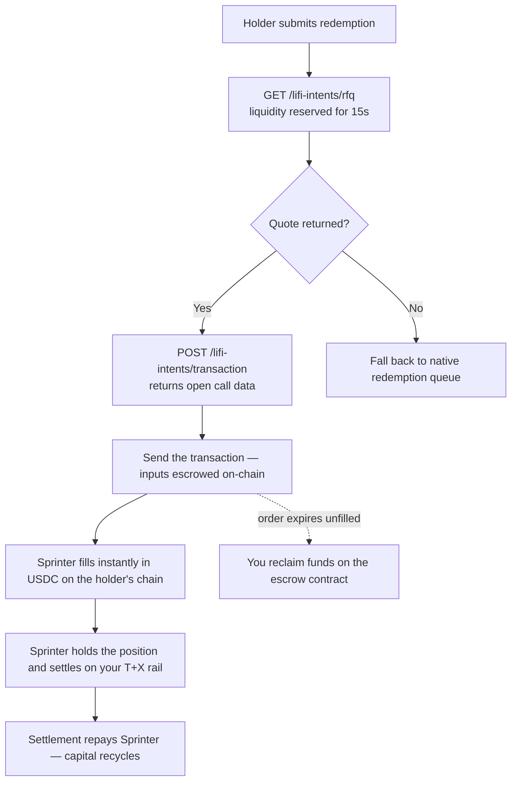

## Overview

If you issue an asset that settles on a delay — a tokenized treasury, a bond fund, a yield-bearing stablecoin, a structured vault — Sprinter can front the liquidity so your holders enter and exit instantly, while the underlying settles on your own rail in the background.

Most tokenized assets share the same friction in both directions. A holder who wants out waits for your redemption rail — T+1 for a tokenized treasury, T+4 for a bond fund, T+30 for some structured products — or takes a discount on a thin secondary market. A holder who wants in, especially from another chain, waits for settlement before the position exists. Sprinter closes both gaps.

<Note>
  The credit is repaid by the settlement itself — your redemption or subscription mechanism — not by liquidating the asset. That is why it needs almost no collateral, and why the price is a function of **how long the rail takes**, not of how volatile the asset is.
</Note>

### Why issuers integrate

- **No idle redemption buffer.** Instead of parking 3–10% of TVL to fund instant exits, outsource that function. Capital that would otherwise sit idle on your balance sheet earns yield in ours.
- **Instant on both sides.** Exits settle immediately in USDC; crosschain deposits credit the position immediately while settlement completes behind it.
- **Works on any settlement path.** Yield-bearing stablecoins, tokenized treasuries and funds, structured and tranched products, RWA-backed tokens. If it has a defined settlement path and a measurable delay, we can front it.
- **Crosschain by default.** Sprinter's solver network services deposits and exits across supported networks, so a holder on one chain can enter or exit a position on another.
- **Optional par experience.** By default Sprinter earns a spread on each fill. Issuers who want a frictionless experience can subsidise that spread so the end user transacts at par — $10 exited returns $10, with no visible fee. The financing cost shifts from the user to you, as a UX and acquisition investment.

Your tokenized asset is onboarded first. Sprinter quotes only assets it has underwritten, allocated liquidity to and configured routes for, so onboarding is step 1 and the runtime calls follow from there.

Two paths. The **solver model** described here gets you live without protocol changes. The **facility model** commits dedicated capacity and is agreed commercially — see [Integration models](#integration-models) below.

The sequence is one onboarding phase, then three runtime steps per redemption:

1. **Onboard the asset** — one time. Underwriting, liquidity allocation, route configuration
2. **Quote** — ask Sprinter what it will pay for the position. Liquidity is reserved against the answer
3. **Open the order** — hand the quote back and get a transaction to send
4. **Settle** — Sprinter fills instantly; you settle the underlying on your rail

---

## Step 1 — Onboard the asset

This is a joint process, not a self-serve API call. Sprinter has to understand the settlement path before it will lend against it, then commit capital and wire up routing. The assessment is about the *settlement path*, not the asset's price.

### What Sprinter underwrites

| | Why Sprinter needs it |
|---|---|
| **Settlement rail** — mechanism, cadence, business-day convention, valuation cut-off, and how variable it is | Sets how long capital is locked, which sets the price |
| **Rail reliability and caps** — historical settlement performance, daily or per-valuation limits on volume, and what happens to requests that breach them | Determines how much can be fronted before hitting your queue |
| **Price source** — NAV stream or oracle, update cadence, acceptable staleness | Sprinter quotes off this; stale prices mean no quote |
| **Issuer reserve adequacy** — whether you maintain your own instant buffer, and how it refreshes | Sizes how much Sprinter needs to front |
| **Secondary market depth** — availability of a fallback exit for positions held during the settlement window | A second exit path lowers the risk premium |
| **Contract addresses** — the token, plus any dedicated mint/redeem or express contracts | Integration and route configuration |
| **Eligibility** — whitelisting on the redemption rail, KYB steps, and any transfer restrictions that apply to Sprinter as counterparty | Sprinter must be able to actually redeem what it holds |
| **Chains** — launch chain priority and planned expansion | Determines which pools and routes are configured |

Underwriting typically takes 1–2 weeks and runs concurrently with onboarding and contract scoping.

### Confirm the asset is live

Before wiring up runtime calls, check that your token is returned by [supported tokens for a chain](/api-reference/sprinter/liquidity/returns-supported-tokens-for-a-chain). If it isn't there, onboarding is not complete and quotes will not return.

<Note>
  Onboarding is per asset and per chain. Adding a second asset, or the same asset on a new chain, needs its own underwriting and route configuration — usually much faster than the first, since the settlement rail is already understood.
</Note>

---

## Runtime flow

Once the asset is live, this runs per redemption.

<div style={{ paddingRight: "120px" }}>

</div>

### Step 2 — Request a quote

Call [`GET /lifi-intents/rfq`](/api-reference/sprinter/lifi-intents/rfq) with the position, the holder's chain, and where the proceeds should land.

```bash
curl --request GET \
  --url 'https://api.sprinter.tech/lifi-intents/rfq?srcChain=eip155:8453&dstChain=eip155:8453&amount=100000000&token=0x833589fcd6edb6e08f4c7c32d4f71b54bda02913&srcToken=YOUR_ASSET_ADDRESS&user=HOLDER_ADDRESS' \
  --header 'X-Auth-Token: YOUR_API_KEY'
```

The response is a firm price with **liquidity already reserved against it**. Keep the whole quote object — step 3 takes it verbatim.

<Warning>
  A quote is valid for **15 seconds**, and the reservation expires with it. Go straight from step 2 to step 3 — do not park a quote behind a user confirmation screen. If the holder needs to confirm, confirm first and quote after.
</Warning>

<Note>
  If no quote returns for an onboarded asset, fall back to your native redemption queue. A `404` means no pool can serve the size right now and is worth one retry after a short backoff; a `400` means the route is not configured and retrying will not help. Sprinter declining a fill should never block a holder from redeeming.
</Note>

### Step 3 — Open the order

POST the quote back to [`POST /lifi-intents/transaction`](/api-reference/sprinter/lifi-intents/transaction). You get the same object with a `transactionRequest` on it — an unsigned `open` call on the escrow contract.

```bash
curl --request POST \
  --url 'https://api.sprinter.tech/lifi-intents/transaction' \
  --header 'Content-Type: application/json' \
  --data @quote.json
```

Send that transaction from the holder's wallet. It escrows the position and publishes the order.

You no longer construct the intent yourself. Sprinter builds it as an exclusive limit order with itself as the filler, priced at the quote, with the deadlines already set — which is what makes the fill deterministic: the holder is quoted a price, and that exact price is what fills.

<Note>
  Include the `quoteId` from step 2 — it is what ties the order to the reserved liquidity. Post a quote without one and you still get valid call data, but nothing is held for it.
</Note>

### Step 4 — Settle, or reclaim

**If filled:** the holder receives USDC immediately on their chosen chain. Sprinter holds the position and settles it through your native rail. When settlement completes, Sprinter is repaid and the capital recycles into the next fill.

**If the order expires unfilled:** you reclaim the funds on the escrow contract. Nothing is stranded — an unfilled order is a no-op.

---

## Integration models

The two models can be used separately or together.

| | Facility model | Solver model |
|---|---|---|
| **Shape** | You commit a facility with Sprinter, sized as a fixed amount or a share of TVL | Sprinter quotes on request and fills as the exclusive solver on the secondary market |
| **How it settles** | Sprinter honours instant credits and exits directly, then queues the underlying settlement | Sprinter buys the position, delivers USDC instantly, then processes the redemption through your native queue |
| **Best for** | Predictable capacity, a published instant-redemption promise to your users | Getting live quickly with no protocol changes |
| **Integration effort** | Asset onboarding plus a facility agreement | Asset onboarding, then the two runtime calls above |

The runtime flow on this page is the solver model. For a committed facility, [talk to us](https://t.me/sprinter_tech/1) — sizing, rate and any collateral requirement are agreed per asset during underwriting.

## Pricing

Credit is priced **per day outstanding**, so the spread is set by the length of your settlement rail:

| Settlement rail | Capital locked | Relative spread per fill |
|---|---|---|
| Same-day | Hours | Lowest |
| T+1 | ~1 day | Low |
| T+2 – T+3 | 2–3 days | Moderate |
| T+5 – T+7 | 5–7 days | High |
| T+8 – T+30 | up to 30 days | Highest |

A committed facility is quoted as an annual rate on committed capacity; just-in-time draws are charged per day and repaid by the settlement. They are the same price expressed two ways.

**Who bears the cost** is a per-facility decision: the end user as a deducted fee, the issuer as a subsidy for a par experience, or a blend.

## Next steps

<CardGroup cols={2}>
  <Card title="Solve RFQ" icon="code" href="/api-reference/solve-rfq/overview">
    Endpoint reference for both runtime calls, and when to use the Swap API instead.
  </Card>
  <Card title="Sprinter Liquidity" icon="book" href="/stash-v1/overview">
    How the liquidity protocol works, and the two ways to access it.
  </Card>
  <Card title="Start onboarding" icon="comments" href="https://t.me/sprinter_tech/1">
    Facility sizing, pricing, and asset underwriting.
  </Card>
</CardGroup>
