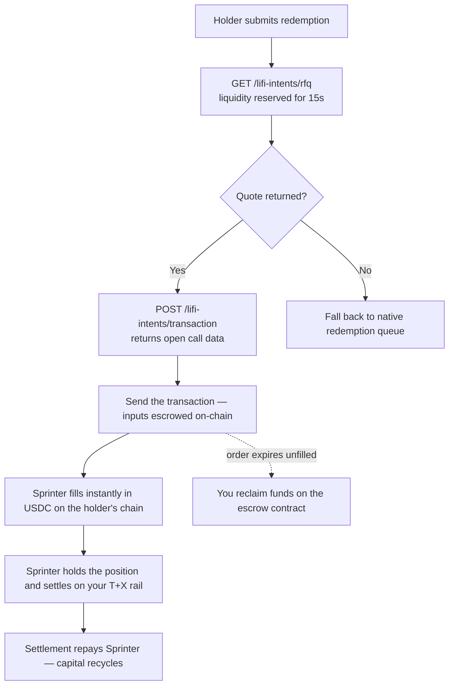

## Overview

If you issue an asset that settles on a delay — a tokenized treasury, a bond fund, a yield-bearing stablecoin, a structured vault — Sprinter can front the liquidity so your holders enter and exit instantly, while the underlying settles on your own rail in the background.

Your tokenized asset is onboarded first. Sprinter quotes only assets it has underwritten, allocated liquidity to and configured routes for, so onboarding is step 1 and the runtime calls follow from there.

Two paths. The **solver model** described here gets you live without protocol changes. The **facility model** commits dedicated capacity and is agreed commercially — see [Redemption & Subscription Liquidity](/stash-v1/redemption-liquidity).

The sequence is one onboarding phase, then three runtime steps per redemption:

1. **Onboard the asset** — one time. Underwriting, liquidity allocation, route configuration
2. **Quote** — ask Sprinter what it will pay for the position. Liquidity is reserved against the answer
3. **Open the order** — hand the quote back and get a transaction to send
4. **Settle** — Sprinter fills instantly; you settle the underlying on your rail

---

## Step 1 — Onboard the asset

This is a joint process, not a self-serve API call. Sprinter has to understand the settlement path before it will lend against it, then commit capital and wire up routing.

### What you submit

| | Why Sprinter needs it |
|---|---|
| **Settlement rail** — mechanism, cadence, business-day convention, valuation cut-off | Sets how long capital is locked, which sets the price |
| **Caps** — daily or per-valuation limits on redemption volume, and what happens to requests that breach them | Determines how much can be fronted before hitting your queue |
| **Price source** — NAV stream or oracle, update frequency, acceptable staleness | Sprinter quotes off this; stale prices mean no quote |
| **Contract addresses** — the token, plus any dedicated mint/redeem or express contracts | Integration and route configuration |
| **Eligibility** — whether Sprinter needs whitelisting on the redemption rail, and the KYB steps | Sprinter must be able to actually redeem what it holds |
| **Chains** — launch chain priority and planned expansion | Determines which pools and routes are configured |

### Confirm the asset is live

Before wiring up runtime calls, check that your token is returned by [supported tokens for a chain](/api-reference/sprinter/liquidity/returns-supported-tokens-for-a-chain). If it isn't there, onboarding is not complete and quotes will not return.

<Note>
  Onboarding is per asset and per chain. Adding a second asset, or the same asset on a new chain, needs its own underwriting and route configuration — usually much faster than the first, since the settlement rail is already understood.
</Note>

---

## Runtime flow

Once the asset is live, this runs per redemption.

<div style={{ paddingRight: "120px" }}>

</div>

### Step 2 — Request a quote

Call [`GET /lifi-intents/rfq`](/api-reference/sprinter/lifi-intents/rfq) with the position, the holder's chain, and where the proceeds should land.

```bash
curl --request GET \
  --url 'https://api.sprinter.tech/lifi-intents/rfq?srcChain=eip155:8453&dstChain=eip155:8453&amount=100000000&token=0x833589fcd6edb6e08f4c7c32d4f71b54bda02913&srcToken=YOUR_ASSET_ADDRESS&user=HOLDER_ADDRESS' \
  --header 'X-Auth-Token: YOUR_API_KEY'
```

The response is a firm price with **liquidity already reserved against it**. Keep the whole quote object — step 3 takes it verbatim.

<Warning>
  A quote is valid for **15 seconds**, and the reservation expires with it. Go straight from step 2 to step 3 — do not park a quote behind a user confirmation screen. If the holder needs to confirm, confirm first and quote after.
</Warning>

<Note>
  If no quote returns for an onboarded asset, fall back to your native redemption queue. A `404` means no pool can serve the size right now and is worth one retry after a short backoff; a `400` means the route is not configured and retrying will not help. Sprinter declining a fill should never block a holder from redeeming.
</Note>

### Step 3 — Open the order

POST the quote back to [`POST /lifi-intents/transaction`](/api-reference/sprinter/lifi-intents/transaction). You get the same object with a `transactionRequest` on it — an unsigned `open` call on the escrow contract.

```bash
curl --request POST \
  --url 'https://api.sprinter.tech/lifi-intents/transaction' \
  --header 'Content-Type: application/json' \
  --data @quote.json
```

Send that transaction from the holder's wallet. It escrows the position and publishes the order.

You no longer construct the intent yourself. Sprinter builds it as an exclusive limit order with itself as the filler, priced at the quote, with the deadlines already set — which is what makes the fill deterministic: the holder is quoted a price, and that exact price is what fills.

<Note>
  Include the `quoteId` from step 2 — it is what ties the order to the reserved liquidity. Post a quote without one and you still get valid call data, but nothing is held for it.
</Note>

### Step 4 — Settle, or reclaim

**If filled:** the holder receives USDC immediately on their chosen chain. Sprinter holds the position and settles it through your native rail. When settlement completes, Sprinter is repaid and the capital recycles into the next fill.

**If the order expires unfilled:** you reclaim the funds on the escrow contract. Nothing is stranded — an unfilled order is a no-op.

## Next steps

<CardGroup cols={2}>
  <Card title="Solve RFQ" icon="code" href="/api-reference/solve-rfq/overview">
    Endpoint reference for both runtime calls, and when to use the Swap API instead.
  </Card>
  <Card title="Redemption & Subscription Liquidity" icon="book" href="/stash-v1/redemption-liquidity">
    How the product works, pricing shape, and underwriting criteria.
  </Card>
  <Card title="Start onboarding" icon="comments" href="https://t.me/sprinter_tech/1">
    Facility sizing, pricing, and asset underwriting.
  </Card>
</CardGroup>
